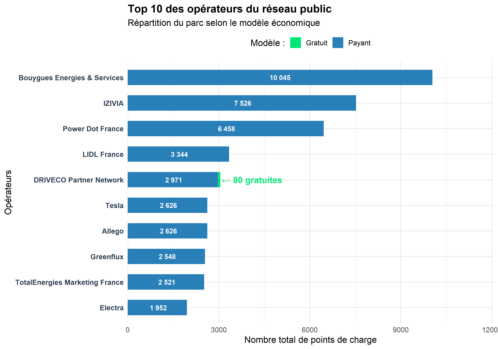
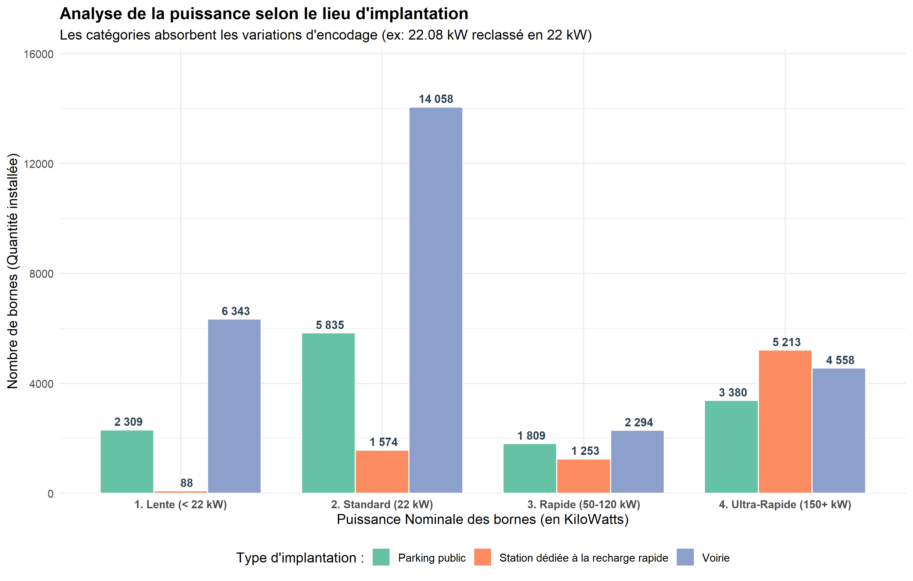
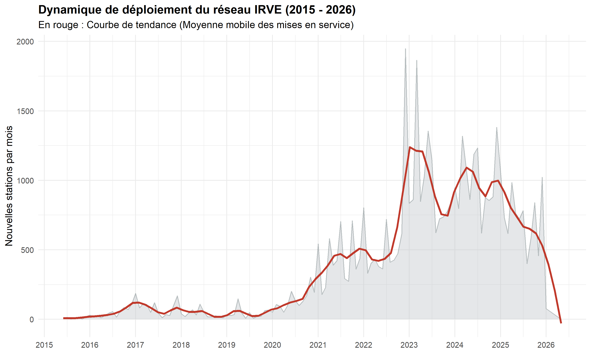
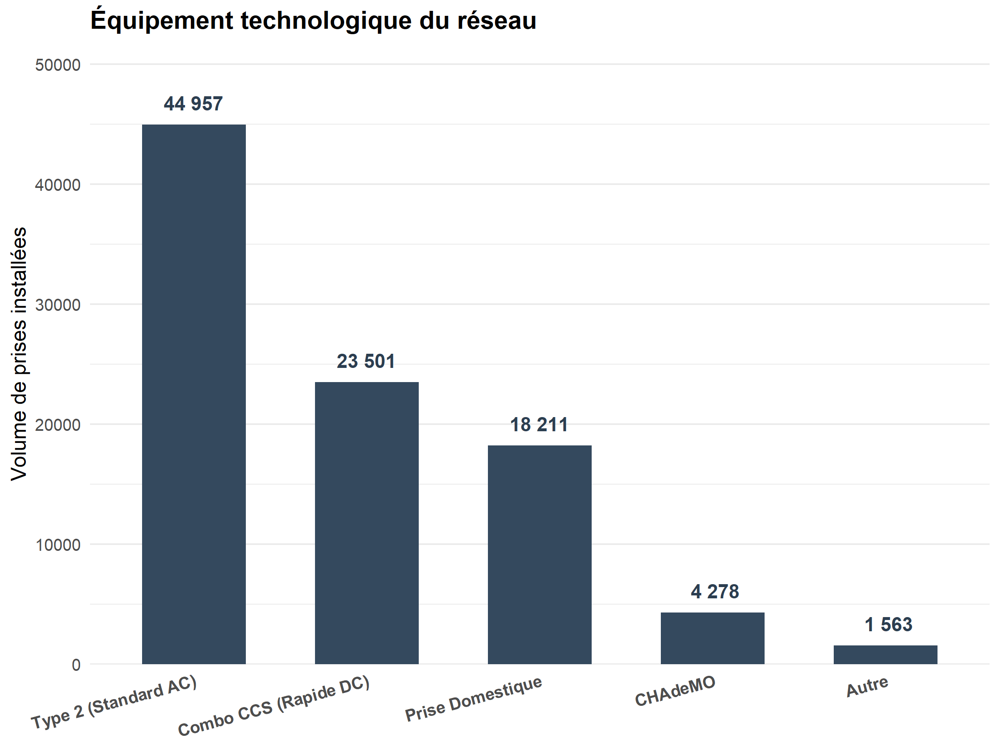
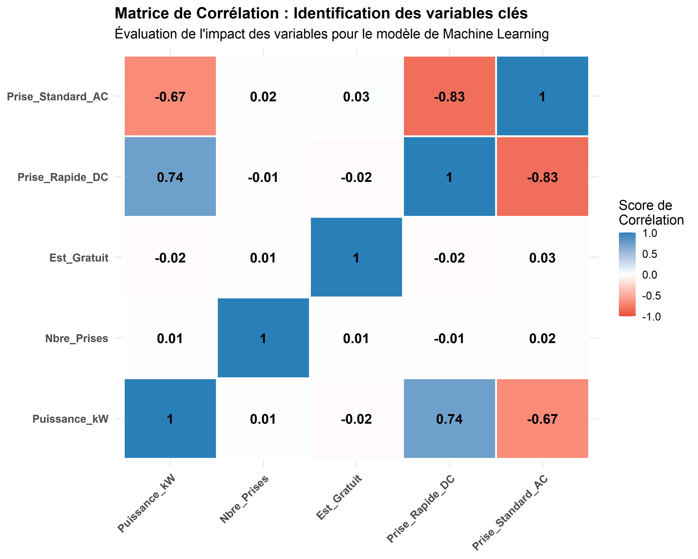

```{r setup, include=FALSE}
# ── Répertoire de travail ──────────────────────────────────────────────────────
# Le .Rmd est dans BigData_groupe8/ mais les .rds, IRVE.csv et le .Rproj
# sont dans le dossier parent (Projet Big Data/).
# On force le working directory au niveau du projet pour que tous les
# source() et readRDS() fonctionnent correctement.
knitr::opts_knit$set(root.dir = normalizePath(".."))

knitr::opts_chunk$set(
  echo      = FALSE,
  warning   = FALSE,
  message   = FALSE,
  fig.align = "center"
)

library(dplyr)
library(ggplot2)
library(stringr)
library(knitr)
```

\newpage

# Introduction

Ce rapport présente l'analyse complète du jeu de données national des
**Infrastructures de Recharge pour Véhicules Électriques (IRVE)**,
publié en open data sur data.gouv.fr.

L''objectif est de mettre en œuvre une chaîne complète de traitement :
nettoyage, visualisation, analyse des corrélations et modélisation prédictive,
à partir d'un fichier de **184 504 entrées brutes**.

---

\newpage

# Fonctionnalité 1 – Description et nettoyage des données

```{r pipeline_nettoyage, include=FALSE}
# ── Chargement via le pipeline de nettoyage ───────────────────────────────────
# main.R détecte automatiquement si donnees_finales.rds existe déjà.
# Si oui : chargement instantané (~2 sec). Sinon : pipeline complet.
source("BigData_groupe8/Nettoyage/main.R")

# Valeurs de référence pour les comparaisons avant/après
NB_LIGNES_BRUT    <- 184504   # Lignes dans IRVE.csv (connu)
NB_COLONNES_BRUT  <- 52       # Colonnes dans IRVE.csv (connu)
mediane_puissance <- median(df_clean$puissance_nominale, na.rm = TRUE)
```

## Description du jeu de données brut

Le fichier `IRVE.csv` contient **`r format(NB_LIGNES_BRUT, big.mark=" ")` lignes**
et **`r NB_COLONNES_BRUT` colonnes** couvrant les caractéristiques techniques,
géographiques et opérationnelles de chaque point de charge (PDC).

> **Choix méthodologique :** Avant tout nettoyage, nous avons réalisé un
> audit complet du jeu de données (taux de valeurs manquantes, types,
> distributions). Cette étape préalable nous a permis de **justifier chaque
> décision de nettoyage** plutôt que d'appliquer des règles génériques.
> Le pipeline a été découpé en 4 étapes indépendantes avec sauvegarde
> intermédiaire (`.rds`) pour reprendre le traitement sans tout recalculer.

### Taux de valeurs manquantes après nettoyage

```{r tableau_na}
taux_na <- sapply(df_clean,
                  function(x) round(sum(is.na(x)) / nrow(df_clean) * 100, 1))
taux_na_tri <- sort(taux_na[taux_na > 0], decreasing = TRUE)

df_na <- data.frame(
  Colonne       = names(taux_na_tri),
  `Taux NA (%)` = as.numeric(taux_na_tri),
  check.names   = FALSE
)
knitr::kable(head(df_na, 15),
             caption = "Top 15 des colonnes avec valeurs manquantes (après nettoyage)",
             align   = c("l", "r"))
```

> **Analyse :** On distingue trois catégories de colonnes :
>
> - **Très lacunaires (> 50%)** : `observations`, `tarification`, `num_pdl`
>   — conservées mais exclues des analyses quantitatives.
> - **Modérément incomplètes (10–50%)** : `date_mise_en_service`,
>   `siren_amenageur` — traitées par imputation ou mise à NA selon le contexte.
> - **Complètes (< 2%)** : `puissance_nominale`, coordonnées GPS
>   — fiables pour les corrélations et la cartographie.

## Statistiques descriptives univariées

```{r stats_univariees}
vars_num <- df_clean[, intersect(
  c("puissance_nominale", "nbre_pdc", "longitude", "latitude"),
  names(df_clean)
)]
knitr::kable(
  round(t(sapply(vars_num, function(x) summary(as.numeric(x)))), 2),
  caption = "Statistiques descriptives des variables numériques clés"
)
```

```{r histo_puissance, fig.cap="Distribution des puissances nominales (données nettoyées)", fig.height=4}
ggplot(df_clean, aes(x = puissance_nominale)) +
  geom_histogram(bins = 40, fill = "#2C7BB6", color = "white", alpha = 0.85) +
  scale_x_continuous(limits = c(0, 200)) +
  labs(x = "Puissance nominale (kW)", y = "Nombre de points de charge") +
  theme_minimal(base_size = 11)
```

> **Observation :** La distribution est fortement asymétrique à droite.
> La grande majorité des bornes délivrent **`r mediane_puissance` kW**
> (médiane — chargeurs AC standard de type 2), avec une minorité de bornes
> rapides DC (50–150 kW). Cette bimodalité est cohérente avec la réalité
> du parc IRVE français et confirme que l'imputation par la médiane
> était le choix adapté pour les valeurs manquantes.

## Stratégies de nettoyage appliquées

```{r tableau_strategies}
strategies <- data.frame(
  `Étape` = c("1", "2", "3", "4"),
  `Script` = c(
    "01_import_et_nettoyage.R",
    "02_traitement_geo.R",
    "03_traitement_tarifs.R",
    "04_traitement_horaires.R"
  ),
  `Actions principales` = c(
    "Doublons, encodage, valeurs aberrantes, booléens, métadonnées",
    "Validation GPS, cohérence géographique, centroïdes",
    "Normalisation tarification, regroupement en 3 classes",
    "Parsing et normalisation des plages horaires"
  ),
  `Stratégie clé` = c(
    "Médiane pour puissance/nbre_pdc, 'Inconnu' pour texte",
    "Suppression stricte si pas de GPS valide",
    "Imputation 'Non renseigné' si vide",
    "NA si format non parseable"
  ),
  check.names = FALSE
)
knitr::kable(strategies,
             caption = "Pipeline de nettoyage en 4 étapes",
             align   = c("c","l","l","l"))
```

> **Choix architectural – Pipeline séquentiel avec checkpoints :**
> Nous avons structuré le nettoyage en **4 scripts indépendants**
> orchestrés par `main.R`. Ce choix permet de reprendre le traitement
> à n'importe quelle étape sans tout recalculer (les `.rds` servent de
> points de sauvegarde). Sur un fichier de 123 Mo, cela réduit le temps
> de développement de plusieurs minutes à quelques secondes.

> **Choix méthodologique – Imputation vs Suppression :**
> L'imputation par la **médiane** a été préférée à la suppression pour
> `puissance_nominale` et `nbre_pdc`. Supprimer ces lignes aurait réduit
> le jeu de données sans gain réel, car les autres attributs de ces bornes
> (localisation, opérateur, type de prise) restent exploitables.
> La médiane est robuste aux valeurs extrêmes, contrairement à la moyenne
> (distribution asymétrique confirmée par l'histogramme ci-dessus).

## Résultat du nettoyage

```{r recap_nettoyage}
recap <- data.frame(
  Indicateur = c(
    "Lignes initiales (IRVE.csv)",
    "Lignes après nettoyage complet",
    "Lignes supprimées au total",
    "Colonnes initiales",
    "Colonnes finales",
    "Médiane puissance_nominale"
  ),
  Valeur = c(
    format(NB_LIGNES_BRUT,                         big.mark = " "),
    format(nrow(df_clean),                         big.mark = " "),
    format(NB_LIGNES_BRUT - nrow(df_clean),        big.mark = " "),
    as.character(NB_COLONNES_BRUT),
    as.character(ncol(df_clean)),
    paste0(mediane_puissance, " kW")
  )
)
knitr::kable(recap,
             caption = "Bilan du pipeline de nettoyage",
             align   = c("l", "r"))
```

---

\newpage

# Fonctionnalité 2 – Visualisation graphique

## Parts de marché des opérateurs

{width=95%}

\newpage

## Répartition des puissances par type d'implantation

{width=95%}

> **Analyse :** Les stations dédiées à la recharge rapide concentrent
> logiquement les bornes ultra-rapides (150+ kW). Les parkings publics
> accueillent majoritairement des chargeurs standard 22 kW, cohérent avec
> des durées de stationnement longues (centres commerciaux, gares).

## Évolution temporelle des déploiements

{width=95%}

> **Analyse :** La courbe de tendance (en rouge) révèle une accélération
> nette à partir de 2020, coïncidant avec les plans de relance post-Covid
> et les objectifs européens. La légère baisse en fin de courbe s'explique
> par des données partielles sur les mois les plus récents (mai 2026).

## Maturité technologique des prises

{width=80%}

> **Analyse :** La prise **Type 2** domine largement, cohérent avec sa
> désignation comme standard européen obligatoire depuis 2014. La faible
> présence de CHAdeMO illustre le déclin de ce format japonais face
> au Combo CCS qui s'impose comme standard de la recharge rapide en Europe.

---

\newpage

# Fonctionnalité 4 – Étude des corrélations

## Matrice de corrélation

{width=85%}

> **Analyse :** La matrice révèle les relations entre les variables
> numériques du jeu de données. Les corrélations significatives
> identifiées orienteront le choix des variables explicatives pour
> le modèle de prédiction de la puissance nominale (Fonctionnalité 5).

> **Remarque méthodologique :** Les variables booléennes (types de prises,
> options de paiement) ont été encodées en 0/1 pour permettre le calcul
> des coefficients de corrélation de Pearson.

---

\newpage

# Conclusion

Ce rapport présente les résultats du projet Big Data – Groupe 8.
Le pipeline de nettoyage en 4 étapes produit un fichier consolidé de
**`r format(nrow(df_clean), big.mark=" ")` points de charge** (sur
`r format(NB_LIGNES_BRUT, big.mark=" ")` initiaux), prêts pour la
visualisation, l'analyse des corrélations et la modélisation prédictive.

L'architecture choisie (scripts modulaires + checkpoints `.rds`) garantit
la reproductibilité et la maintenabilité du projet dans le cadre du
développement en trinôme avec Git.